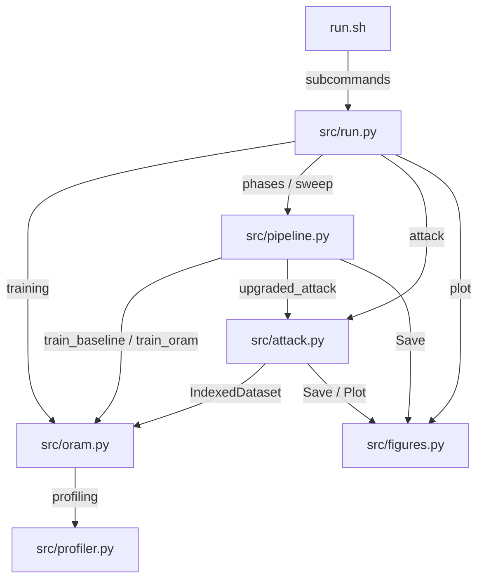

# OMLO

Privacy-preserving ML training system that integrates Path ORAM into PyTorch pipelines to eliminate data-dependent memory access patterns. A membership inference attack pipeline empirically evaluates leakage under plaintext vs ORAM access.

## Architecture



## Files

| File | Purpose |
|------|---------|
| `src/run.py` | Unified CLI: training, event generation, trace conversion, attack, plotting |
| `src/oram.py` | Path ORAM storage, ORAM-backed DataLoader, training loop |
| `src/pipeline.py` | Experiment orchestration, strace/eBPF parsing, phased benchmarks, sweeps |
| `src/attack.py` | Membership inference: feature engineering, sklearn model comparison |
| `src/figures.py` | Phase-result plots, persistence helpers, LaTeX table builders |
| `src/profiler.py` | Wall-clock timing, memory profiling, JSON report generation |
| `src/test_core.py` | 23 unit tests covering ORAM storage, profiler, attack, events |
| `run.sh` | Shell orchestrator: venv setup, phased experiments, OS-level tracing |
| `requirements.txt` | Python dependencies (torch, pyoram, sklearn, matplotlib, etc.) |
| `.gitlab-ci.yml` | CI: runs `./run.sh smoke` on Python 3.10 |
| `reports/` | Paper LaTeX source (llncs class) |

## Entry Points

| Command | Effect |
|---------|--------|
| `python src/run.py baseline` | Standard CIFAR-10 training |
| `python src/run.py oram` | ORAM-backed CIFAR-10 training |
| `python src/run.py event` | Generate synthetic access-pattern event log |
| `python src/run.py mi` | Run membership inference attack on event log |
| `python src/run.py phases --phase all` | Run all 9 experiment phases (0-8) |
| `python src/run.py plot` | Generate all phase-result figures |
| `python src/run.py leakage` | Generate plaintext vs ORAM access frequency logs |
| `bash run.sh smoke` | Quick baseline + ORAM validation (2 epochs) |
| `bash run.sh experiments` | 5-step pipeline: baseline, ORAM, sweeps, plot |
| `bash run.sh pipeline` | All 9 phases + plot via `phases --phase all` |
| `bash run.sh trace` | OS-level trace capture (Linux, requires strace/eBPF) |
| `bash run.sh visibility` | Partial observability sweep |
| `bash run.sh results` | Paper-ready membership inference evaluation |

## Verification

```bash
python -m venv venv && source venv/bin/activate
pip install -r requirements.txt
cd src && python test_core.py
cd .. && bash run.sh smoke
python src/run.py setup
python src/run.py system
```
