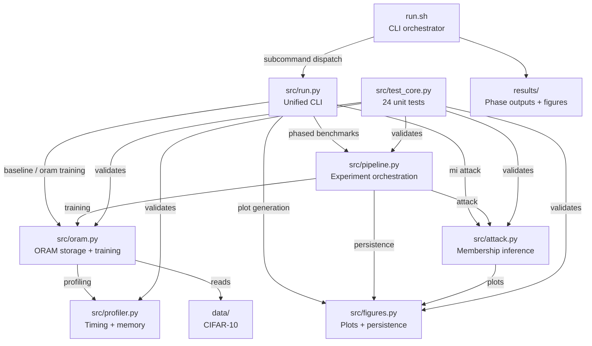

# OMLO

## Purpose

Privacy-preserving ML training system that integrates Path ORAM into PyTorch data pipelines. Eliminates data-dependent memory access patterns during CIFAR-10 training. A membership inference attack pipeline empirically evaluates leakage under plaintext, obfuscated, and ORAM-backed access.

## Architecture



## Files

| File | Purpose |
|------|---------|
| `src/run.py` | Unified CLI: training, event generation, trace conversion, attack, plotting |
| `src/oram.py` | Path ORAM storage (PyORAM), ORAM-backed DataLoader, baseline/ORAM training loops |
| `src/pipeline.py` | Experiment orchestration, strace/eBPF/fs_usage trace parsing, phased benchmarks, sweeps |
| `src/attack.py` | Membership inference: 40+ feature engineering, sklearn model comparison, partial observability |
| `src/figures.py` | Phase-result plots (7 figures), CSV/JSON persistence, LaTeX table generation |
| `src/profiler.py` | Wall-clock timing, memory profiling, overhead breakdown, JSON report output |
| `src/test_core.py` | 24 unit tests covering ORAM storage, profiler, attack features, events, PyORAM API |
| `run.sh` | Shell orchestrator: venv setup, phased experiments, OS-level tracing, smoke tests |
| `requirements.txt` | Python dependencies (torch, pyoram, sklearn, matplotlib, xgboost, etc.) |
| `mypy.ini` | Mypy configuration: per-module error suppression for strict mode |
| `.gitlab-ci.yml` | CI: runs `./run.sh smoke` on Python 3.10 |
| `reports/` | Paper LaTeX source (LLNCS class) |

## Entry Points

| Command | Effect |
|---------|--------|
| `python src/run.py baseline` | Standard CIFAR-10 training (ResNet-18, SGD) |
| `python src/run.py oram` | ORAM-backed CIFAR-10 training |
| `python src/run.py sidecar` | ORAM training with batch-level sidecar logging |
| `python src/run.py event --mode plaintext --output X` | Generate synthetic plaintext access-pattern event log |
| `python src/run.py event --mode oram --output X` | Generate synthetic ORAM access-pattern event log |
| `python src/run.py partial` | Generate event log with partial observability noise |
| `python src/run.py mi --input X --output_dir Y` | Run membership inference attack on event log |
| `python src/run.py mi-simple` | Simple frequency-based membership inference baseline |
| `python src/run.py phases --phase all` | Run all 9 experiment phases (0-8) |
| `python src/run.py experiments` | Full multi-defense experiment (plaintext, obfuscated, ORAM) |
| `python src/run.py sweep --sweep all` | Parameter sweeps (batch_size, dataset_size, block_size) |
| `python src/run.py convert` | Convert OS-level trace (strace/eBPF/fs_usage) to attack input |
| `python src/run.py plot` | Generate all 7 phase-result figures |
| `python src/run.py leakage` | Generate plaintext vs ORAM access frequency logs |
| `python src/run.py inference` | Full plaintext + ORAM attack sweep with summary |
| `python src/run.py attack --results_dir X --output Y` | Generate LaTeX tables from attack results |
| `python src/run.py privacy --summary X` | Privacy-performance tradeoff plot |
| `python src/run.py membership` | Membership attack comparison plot |
| `python src/run.py robustness --summary X` | Attack robustness vs visibility plot |
| `python src/run.py files` | Materialize CIFAR-10 as files on disk |
| `python src/run.py train --dataset_root X` | Train from materialized files with sidecar logging |
| `python src/run.py trace --pid N` | Trace file opens via eBPF for a running process |
| `python src/run.py probe --input X` | Validate probe design on event log |
| `python src/run.py reference` | Run reference implementation |
| `python src/run.py upgraded` | Interactive demo |
| `python src/run.py setup` | Verify environment setup |
| `python src/run.py system` | Validate complete system |
| `bash run.sh smoke` | Unit tests + baseline + ORAM validation (2 epochs) |
| `bash run.sh experiments` | 5-step pipeline: baseline, ORAM, sweeps, plot |
| `bash run.sh pipeline` | All 9 phases + plot via `phases --phase all` |
| `bash run.sh trace [--yes]` | OS-level trace capture (Linux, requires strace/eBPF) |
| `bash run.sh visibility` | Partial observability sweep (4 visibility levels) |
| `bash run.sh attack` | Plaintext vs ORAM attack comparison test |
| `bash run.sh results [--yes]` | Paper-ready membership inference evaluation |
| `bash run.sh macos` | macOS physical-access audit with fs_usage |

## Verification

```bash
python -m venv venv && source venv/bin/activate
pip install -r requirements.txt
cd src && python test_core.py
cd .. && bash run.sh smoke
```
